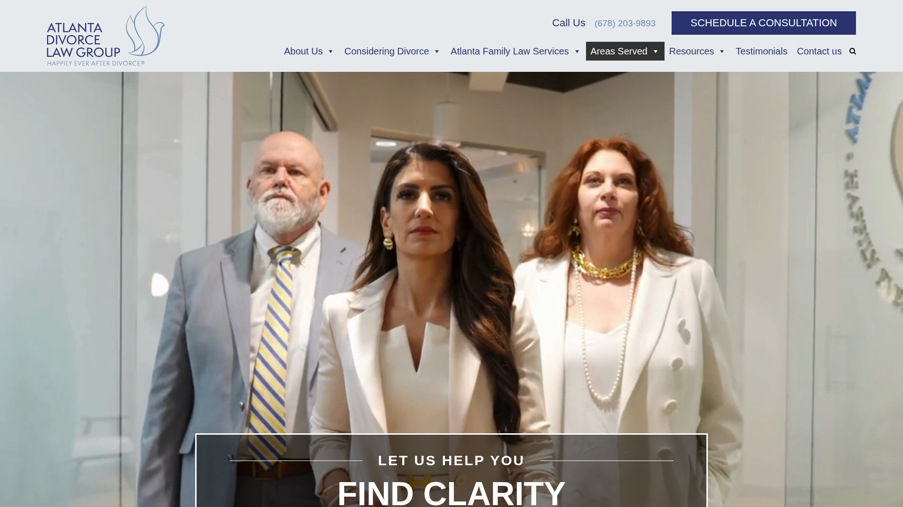
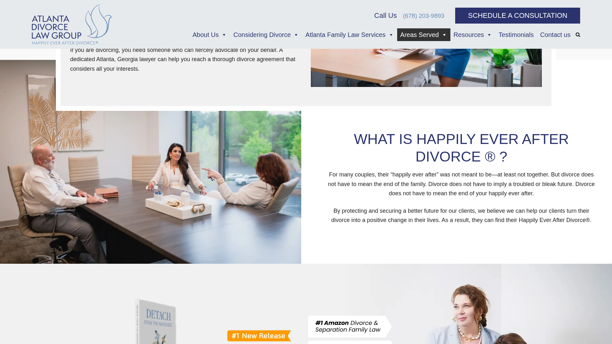
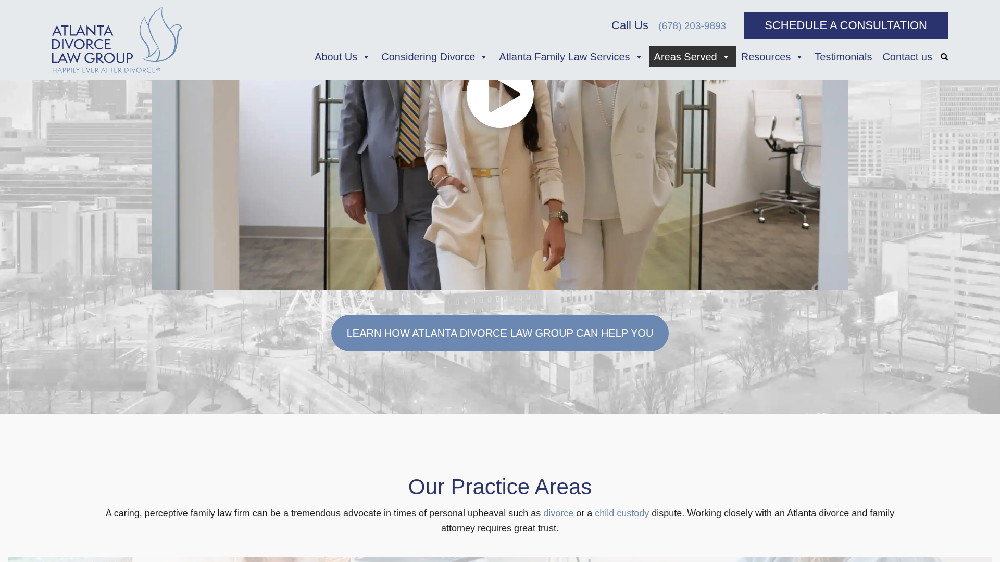
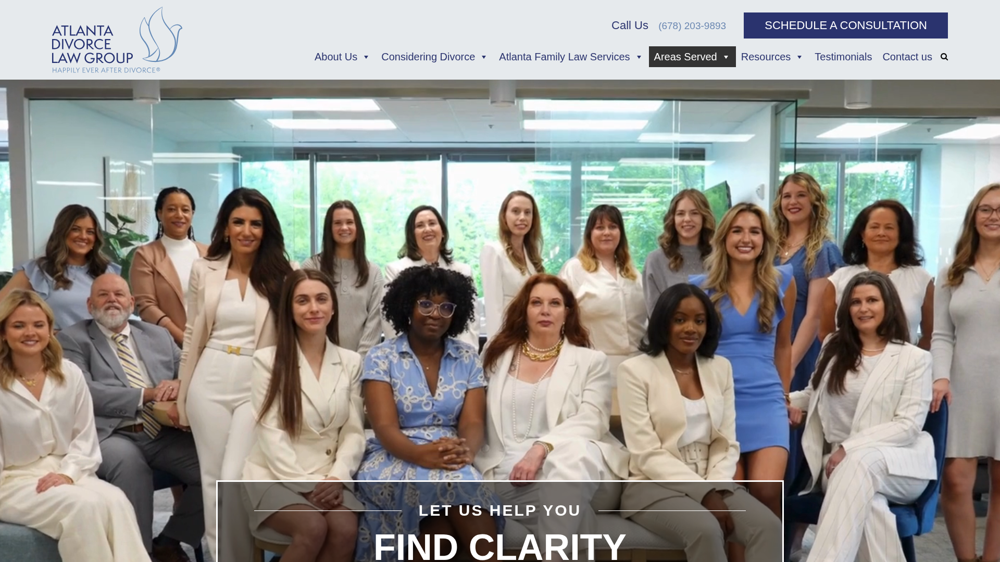
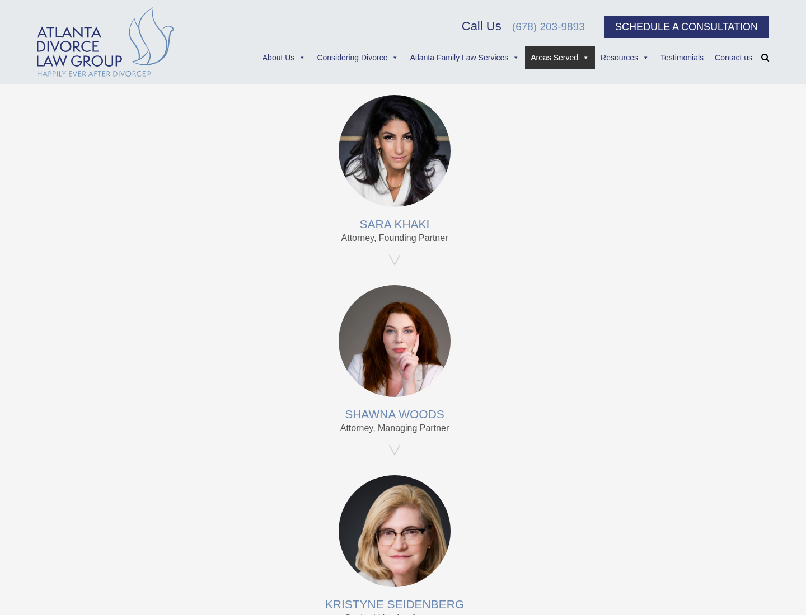
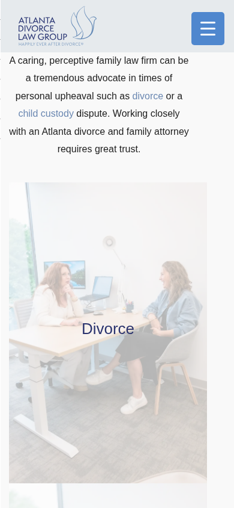
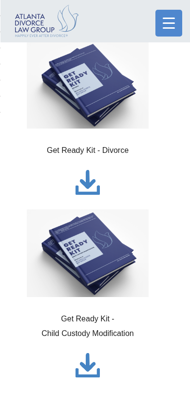

# Atlanta Divorce Law Group — Kestrel Lead Analysis

- **Business name:** Atlanta Divorce Law Group
- **Website:** <https://atlantadivorcelawgroup.com>
- **Captured/reviewed:** 2026-03-18
- **Status:** Pursue
- **Likely first offer:** Website Credibility Refresh

---

## 1. Prospect Snapshot

- **Business name:** Atlanta Divorce Law Group
- **Category / type:** Divorce and family law firm
- **Apparent location:** Atlanta, Georgia
- **Short summary:** A Georgia family-law firm focused on divorce, custody, assets, alimony, and adjacent emotional/support content around divorce recovery.

## 2. Analysis Mode / Confidence

- **Mode:** Primarily **rendered-page/browser inspection** of the live site, plus text extraction from the public homepage.
- **Tools used:** OpenClaw browser tool, rendered screenshots, web fetch, targeted Playwright evidence capture.
- **Desktop review standard:** Large desktop viewport approximating a maximized/fullscreen browsing context.
- **Mobile review standard:** Phone-sized viewport with a separate mobile pass and dedicated screenshots.
- **Confidence:** **Moderate**
- **Limits:**
  - I was able to inspect the real rendered site experience.
  - The original local Playwright full-page capture script failed on this site, so I used a more controlled targeted capture flow for evidence screenshots.
  - I could not enrich with external review/map data because `web_search` was exposed but not properly configured in the current environment.
  - Business-quality judgment is therefore weighted more toward **onsite signals** than offsite reputation evidence.

## 3. First Impression

### What feels strong

- The firm appears **substantial and established**, not like a solo shop pretending to be bigger.
- Large team presence, books/podcast/resources, and repeated consultation CTAs signal a real operation.
- The site has a **serviceable trust-heavy structure**: practice areas, advocacy framing, team, testimonials, contact form, office locations.

### What feels weak

- The site feels **visually busy and somewhat dated**.
- Hero area and media usage feel heavier than they need to for a high-trust legal site.
- The experience tries to do many things at once: legal services, emotional support brand, book, podcast, resources, testimonials, newsletter, offices.
- That creates a slight **identity split** between law firm, media brand, and support ecosystem.

### Does the business seem more credible than the website suggests?

- **Yes.**
- My read is that the firm itself is likely more operationally mature and premium than the website fully communicates.

## 4. Evidence Gallery

### First impression / hero
- Evidence file: `evidence/01-hero-first-impression.png`

- What it shows:
  - A homepage opening that immediately combines video/media, multiple calls to action, and a content-heavy transition into the rest of the page.
- Why it matters:
  - For a divorce/family-law prospect, the first impression should feel steadier and more composed. Instead, the opening feels more layered than calming.
- Suggested improvement:
  - Simplify the opening sequence, tighten the message hierarchy, and reduce competing visual inputs in the first screenful.

### Trust / credibility signal
- Evidence file: `evidence/02-trust-team-and-testimonials.png`

- What it shows:
  - Strong proof-of-scale material: visible team depth, social proof, and signs of a sizable operation.
- Why it matters:
  - This is one of the clearest indications that the business itself is more mature than the site’s overall composure suggests.
- Suggested improvement:
  - Keep these trust assets, but integrate them into a calmer, more deliberate narrative flow.

### Weakness / UX issue #1
- Evidence file: `evidence/03-issue-busy-homepage-rhythm.png`

- What it shows:
  - A stacked sequence of sections that keeps shifting topic and format: legal service framing, support content, resource/media elements, and promotional modules.
- Why it matters:
  - The page reads as **accumulation** rather than a guided trust journey. It adds cognitive load in a category where visitors are already under stress.
- Suggested improvement:
  - Reduce module count on the homepage, group related content more clearly, and build a stronger section rhythm from reassurance → authority → next step.

### Weakness / UX issue #2
- Evidence file: `evidence/04-bug-video-fallback-state.png`

- What it shows:
  - The visible “Your browser does not support the video tag” fallback state surfaced during rendered inspection.
- Why it matters:
  - Even if not every visitor sees it, this is the kind of rough edge that weakens polish and trust in a premium-trust category.
- Suggested improvement:
  - Replace with a controlled static fallback image/poster state and remove any raw fallback copy from the rendered experience.

### CTA / consultation section
- Evidence file: `evidence/05-cta-consultation-section.png`

- What it shows:
  - A clear consultation-oriented conversion area near the lower portion of the page.
- Why it matters:
  - The site does have legitimate conversion intent and knows it needs to move visitors toward contact.
- Suggested improvement:
  - Make the path to consultation feel more direct earlier in the experience, with less narrative clutter before the user gets there.

### Mobile first impression
- Evidence file: `evidence/07-mobile-first-impression.png`

- What it shows:
  - The mobile opening compresses the site’s already busy hierarchy into a narrow vertical experience.
- Why it matters:
  - On phone, the initial trust signal has less room to breathe, which makes the page feel denser faster.
- Suggested improvement:
  - Simplify the opening content stack and make the first mobile screens more singular and deliberate.

### Mobile density / long-scroll issue
- Evidence file: `evidence/09-mobile-long-scroll-density.png`

- What it shows:
  - Long vertical stacking of many content types, with repeated transitions between service framing, media, trust, and promotional material.
- Why it matters:
  - This increases cognitive fatigue and makes the mobile experience feel heavier than it should for a high-stress category.
- Suggested improvement:
  - Consolidate or remove lower-priority homepage modules for mobile users and shorten the scroll before the primary trust + CTA path.

### Mobile CTA / contact flow
- Evidence file: `evidence/08-mobile-cta-and-contact-flow.png`

- What it shows:
  - The mobile consultation/contact area exists, but it arrives after a long content journey.
- Why it matters:
  - The user has to absorb a lot before reaching the most important action.
- Suggested improvement:
  - Introduce a cleaner, earlier CTA path on mobile and reduce the need to scroll through multiple nonessential sections first.

## 5. Required Experience Dimensions

### Visual composure
- Mixed.
- The site is not incompetent, but it does **not feel especially calm or controlled**.
- There are many section changes, images, cards, modules, and content shifts competing for attention.
- Overall feel: **busy / layered / somewhat uneven**, rather than disciplined and intentional.
- Evidence:
  - `evidence/01-hero-first-impression.png`
  - `evidence/03-issue-busy-homepage-rhythm.png`
  - `evidence/07-mobile-first-impression.png`

### Readability / contrast
- Generally readable, but not especially elegant.
- Body text appears legible enough.
- The bigger issue is less literal contrast failure and more **density + pacing**.
- Some sections feel like they ask for a lot of reading without enough visual quiet.
- Evidence:
  - `evidence/03-issue-busy-homepage-rhythm.png`
  - `evidence/09-mobile-long-scroll-density.png`

### Motion quality
- There’s a video-heavy hero/media presence, and the page hints at a richer motion/media layer.
- From the rendered pass, the motion/media choice feels more **marketing-ish than reassuring**.
- Not obviously broken, but not especially refined either.
- The “Your browser does not support the video tag” text surfacing in the rendered inspection is a mild quality blemish.
- Evidence:
  - `evidence/04-bug-video-fallback-state.png`

### Section rhythm / narrative flow
- This is one of the bigger weaknesses.
- The page doesn’t move with clean narrative economy.
- It goes from hero → service framing → video/help content → brand concept → book → resources → podcast → team → testimonials → contact → newsletter → offices.
- That reads as **stacked accumulation**, not a tightly guided trust journey.
- The same weakness becomes more pronounced on mobile because the user experiences it as a long sequence of stacked modules.
- Evidence:
  - `evidence/03-issue-busy-homepage-rhythm.png`
  - `evidence/09-mobile-long-scroll-density.png`

### Premium / trust feel
- The site does create trust through **volume of evidence**.
- But it does **not feel as premium as the firm likely is**.
- It feels more like a capable, content-heavy regional practice than a sharply positioned, high-trust premium legal brand.
- Evidence:
  - `evidence/02-trust-team-and-testimonials.png`
  - `evidence/01-hero-first-impression.png`
  - `evidence/07-mobile-first-impression.png`

### Calm vs. chaos
- For a divorce/family-law firm, this matters a lot.
- The site currently adds a bit of **cognitive load** where it should probably reduce it.
- It’s not chaotic in a broken sense, but it is **too busy for a category where emotional steadiness is part of the product**.
- This is even more noticeable on mobile.
- Evidence:
  - `evidence/03-issue-busy-homepage-rhythm.png`
  - `evidence/09-mobile-long-scroll-density.png`
  - `evidence/08-mobile-cta-and-contact-flow.png`

## 6. Website / Digital Findings

- The site appears to be **underselling the firm’s maturity**.
- Messaging is understandable, but there’s too much of it competing at once.
- Navigation/structure likely works, but the homepage feels **overpacked**.
- The brand concept around **“Happily Ever After Divorce®”** is memorable, but it can also soften or blur the legal-service positioning if not tightly framed.
- CTA presence is strong, but **focus is diluted** by the number of adjacent content offerings.
- Team scale is a meaningful trust signal; that’s a strength.
- Testimonials and offices reinforce legitimacy.
- The rendered experience suggests a **website credibility refresh opportunity**, not necessarily a full strategic rewrite from zero.
- On mobile, the long-scroll narrative becomes even heavier, which likely weakens clarity and emotional steadiness for first-time visitors.
- The site likely performs its basic job, but not with the level of composure that would best support premium trust conversion.

## 7. Business Quality Signals

### Positive signals

- Large visible team
- Clear practice-area specialization
- Strong content engine: book, podcast, guides/resources
- Multiple office/location signals
- Many testimonials
- Repeated consultation path

### What that suggests

- This looks like a **real, scaled, serious small-to-midsize firm**, not a flimsy lead-gen shell.
- They likely invest in growth and branding.
- They probably have meaningful client volume and enough operational structure to support professional services spend.

### Caution

- Without maps/review enrichment, I’d avoid overstating reputation specifics.
- But based on the site alone, this looks like a **credible pursue** lead.

## 8. Kestrel Fit Assessment

**Decision: Pursue**

### Why

- The firm appears established enough to pay for thoughtful digital work.
- The current site likely **underdelivers on trust feel relative to actual business quality**.
- Legal is a category where Kestrel’s “calm, credible, restrained” positioning can land well.
- There’s a plausible wedge without trying to sell a giant rebuild immediately.
- The homepage experience has enough visible friction to justify improvement.
- The business seems serious enough that a founder-led, selective pitch could resonate.

## 9. Best First Offer

**Best first engagement: Website Credibility Refresh**

### Why this is the best wedge

- The biggest issue is not “they have no website.”
- It’s that the website likely does **not match the maturity, seriousness, and emotional steadiness** the firm wants clients to feel.
- A credibility refresh is a lower-friction entry than a total rebuild and easier to pitch to an established firm.
- It can focus on:
  - homepage simplification
  - calmer visual hierarchy
  - clearer trust sequencing
  - stronger consultation path
  - reducing brand/message sprawl
  - mobile-specific shortening and prioritization of the homepage flow

## 10. Suggested Path Forward

- **Outreach now**
- But use a **highly specific angle**
- Don’t pitch “marketing,” “SEO,” or “more leads” in generic terms
- Pitch around:
  - reducing visual/cognitive load
  - making the site feel more composed and trustworthy
  - aligning the digital front door with the seriousness of the firm
  - improving the mobile trust and CTA path, not just the desktop homepage

## 11. Ballpark Budget Range

- **$8k–$20k**
- Reason:
  - This looks like an established firm with enough complexity and stakes to justify professional web work.
  - For a first engagement, the likely fit is not a tiny brochure tweak, but also not necessarily a full six-figure platform overhaul.
  - A homepage/IA/trust-flow refresh with selective page improvements sits plausibly in this band.

## 12. Outreach Tailoring

### Possible subject lines

- **A small observation about ADLG’s website**
- **Your firm feels more established than the homepage does**

### Outreach angle summary

ADLG appears strong and mature, but the homepage experience feels busier and less composed than the firm itself likely is. A restrained refresh could make the site feel calmer, clearer, and more trustworthy for people already under stress—especially on mobile.

### Personalized outreach email draft

Hi — I spent a little time looking through Atlanta Divorce Law Group’s site.

My impression was that the firm itself comes across as substantial and well-developed, but the homepage experience feels busier than it needs to for a practice in such a trust-sensitive category. There’s a lot of strong material there — team depth, resources, testimonials, consultation flow — but the overall presentation doesn’t feel quite as calm or controlled as the firm likely is in real life.

That kind of gap is often fixable without reinventing everything. Sometimes it’s mostly a matter of tightening hierarchy, reducing visual noise, and making the path from first impression to consultation feel more composed — especially on mobile, where long stacked pages tend to feel even heavier.

I run Kestrel Labs, and this is the sort of credibility/clarity work I help with on a selective basis. If useful, I’d be happy to send over a few concrete observations on what I’d simplify first.

Best,  
Daymian  
Kestrel Labs

## 13. Internal Summary for CRM

- **One-line summary:** Established Atlanta family-law firm with strong operational signals; website feels busier and less premium than the business likely is, especially on mobile.
- **Likely offer:** Website Credibility Refresh
- **Disposition:** Pursue
- **Next step:** Send tailored outreach focused on calmer trust flow, reduced homepage clutter, and stronger alignment between firm maturity and site presentation across desktop and mobile.

## Bottom line

ADLG looks like a **real lead**, not a stretch.

If Kestrel goes after them, I’d keep the pitch narrow:

- not “we can redesign your whole brand”
- not “we’ll get you more leads”
- but:
  - **your firm feels more composed than your site**
  - **a calmer, sharper front door would likely serve you better**
  - **that gap is even more noticeable on mobile**
