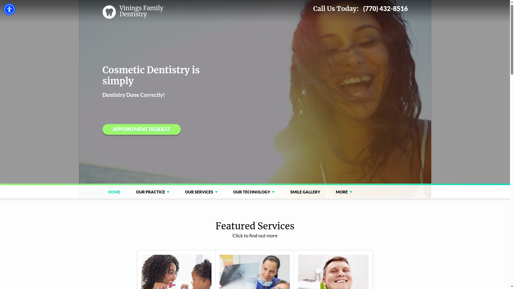
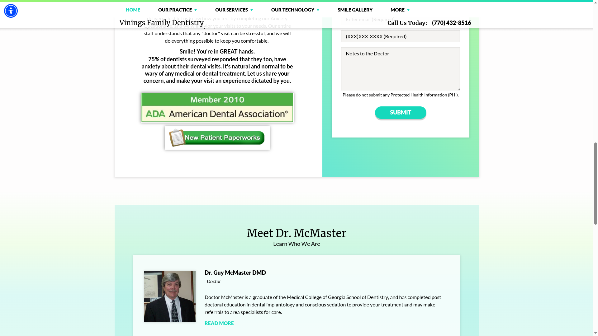
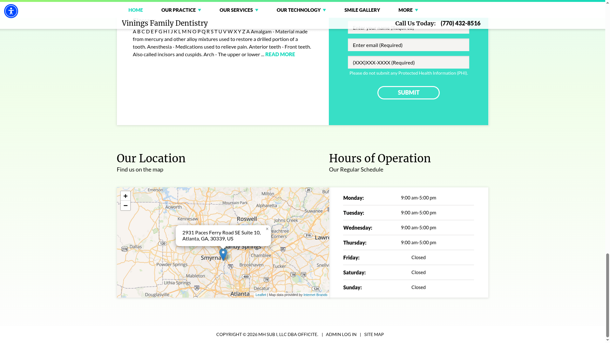
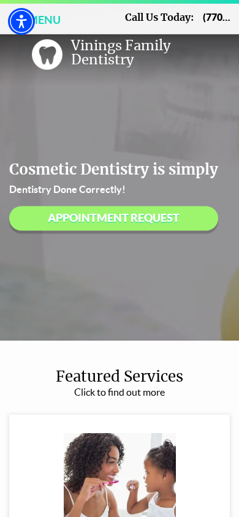
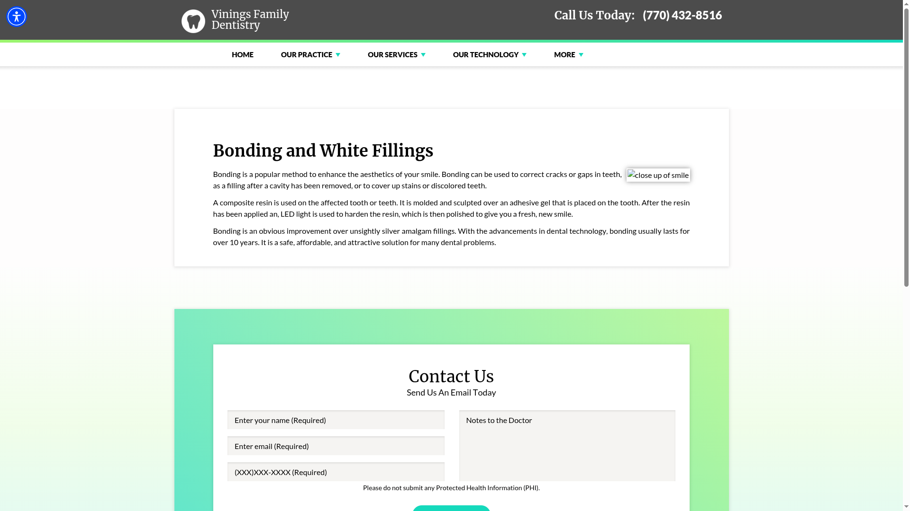
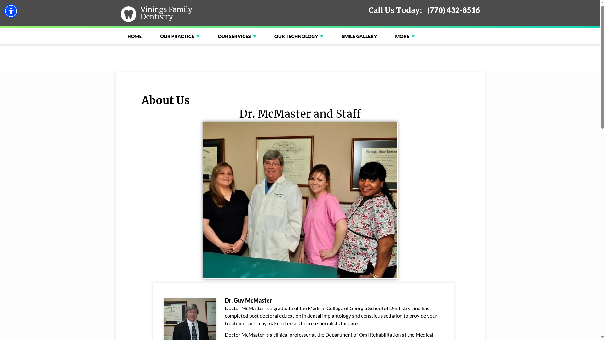
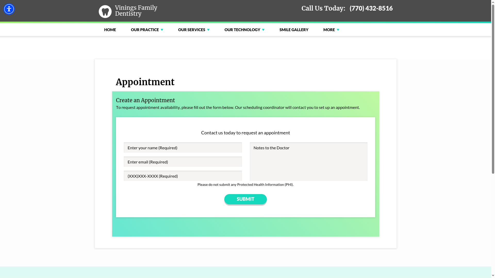

# Vinings Family Dentistry — Kestrel Lead Analysis

- **Business name:** Vinings Family Dentistry
- **Website:** <https://viningsfamilydentistry.com>
- **Captured/reviewed:** 2026-03-18
- **Status:** Pursue
- **Likely first offer:** Website Credibility Refresh

---

## 1. Prospect Snapshot

- **Business name:** Vinings Family Dentistry
- **Category / type:** Family / cosmetic dental practice
- **Apparent location:** Atlanta, Georgia
- **Short summary:** A dental practice serving the Atlanta/Vinings area, with general and cosmetic dentistry positioning, a wide service menu, appointment-request flow, doctor/practice content, and a large amount of template-driven educational/patient-resource content.

## 2. Analysis Mode / Confidence

- **Mode:** Rendered browser analysis of selected live pages, supported by raw screenshot capture, sitemap review, and public-page text extraction.
- **Tools used:** Sitemap fetch, Playwright raw/live capture, OpenClaw browser inspection, web fetch.
- **Desktop review standard:** Representative desktop browser viewport at **1920x1080**.
- **Mobile review standard:** iPhone-class mobile viewport at roughly **390x844**.
- **Capture fidelity:** Raw/live capture with no style or layout overrides.
- **Capture path:** Headless first; **headed fallback** for desktop because the site returned 403 to desktop headless automation. Mobile succeeded in headless mode.
- **Sitemap / capture plan:** A real sitemap was available and used to choose homepage, a representative service page, about page, and appointment page.
- **Confidence:** **Moderate**
- **Limits:**
  - The site was captured and reviewed from its rendered experience across multiple pages rather than homepage-only.
  - Desktop headless automation was blocked with 403, so desktop evidence was rerun successfully in headed mode.
  - `web_search` is still not properly configured in this environment, so I could not enrich with Maps/review/LinkedIn context.
  - Business-quality judgment is therefore based mostly on onsite signals.

## 3. First Impression

### What feels strong

- The practice appears real, established, and operational rather than speculative or flimsy.
- There is visible patient-reassurance messaging around comfort and anxiety.
- The service catalog is broad, which suggests a real local practice with operational depth.
- Appointment intent is present and easy to spot early on the homepage.

### What feels weak

- The site feels **dated, template-driven, and overextended**.
- A lot of the site looks like it came from a stock dental-site platform rather than from a thoughtful modern patient experience.
- The trust story is there, but it requires too much reading and visual tolerance to absorb.
- The appointment path appears less polished than it should, and the appointment page itself shows an error state in extracted content.

### Does the business seem more credible than the website suggests?

- **Yes.**
- The business likely feels more trustworthy and current in real life than the website communicates.

## 4. Sitemap / Capture Plan

- **Sitemap source:** `https://www.viningsfamilydentistry.com/sitemap.xml`
- **Pages discovered:** The sitemap exposed a broad set of pages including about, appointment, blog, many individual services, patient resources, and educational content.
- **Pages selected for analysis:**
  - Homepage — `https://www.viningsfamilydentistry.com/`
  - Primary service page — `https://www.viningsfamilydentistry.com/bonding-and-white-fillings`
  - About / practice page — `https://www.viningsfamilydentistry.com/about-us`
  - Appointment page — `https://www.viningsfamilydentistry.com/appointment`
- **Why these pages were chosen:**
  - The homepage shows first impression, hierarchy, and broad positioning.
  - The service page tests whether the trust/value story holds up beyond the homepage.
  - The about page checks doctor/practice credibility and local trust framing.
  - The appointment page tests actual conversion flow quality instead of assuming the homepage CTA is enough.

## 5. Evidence Gallery

### Full-page desktop view
- Evidence file: `evidence/00-fullpage-desktop-homepage.png`
- View source image: [00-fullpage-desktop-homepage.png](evidence/00-fullpage-desktop-homepage.png)
- Why it matters:
  - This shows the full homepage architecture and makes the template-heavy, module-stacked structure obvious.

### Full-page mobile view
- Evidence file: `evidence/00-fullpage-mobile-homepage.png`
- View source image: [00-fullpage-mobile-homepage.png](evidence/00-fullpage-mobile-homepage.png)
- Why it matters:
  - This shows how the same template structure becomes denser and more cumbersome on mobile.

### Homepage hero / first impression
- Evidence file: `evidence/01-home-hero-first-impression.png`

- What it shows:
  - A dated-feeling hero with broad cosmetic-dentistry messaging and an appointment CTA.
- Why it matters:
  - The CTA is visible, but the visual language doesn’t feel especially current or premium for a healthcare practice.
- Suggested improvement:
  - Modernize the hero, tighten copy, and make the first impression calmer and more trust-heavy.

### Homepage trust / proof section
- Evidence file: `evidence/02-home-trust-proof-section.png`

- What it shows:
  - Welcome copy, patient-comfort messaging, and supporting trust material.
- Why it matters:
  - The trust ingredients are present, but the execution is text-heavy and visually dated.
- Suggested improvement:
  - Keep the reassurance content, but simplify the presentation and improve hierarchy.

### Homepage rhythm issue
- Evidence file: `evidence/03-home-issue-homepage-rhythm.png`

- What it shows:
  - A sequence of stacked modules that feels more like a practice-site template than a guided patient journey.
- Why it matters:
  - Visitors have to wade through too much structure before the site feels coherent.
- Suggested improvement:
  - Reduce module count and create a clearer narrative from trust → service clarity → appointment.

### Mobile first impression
- Evidence file: `evidence/04-home-mobile-first-impression.png`

- What it shows:
  - The homepage compresses quickly on mobile, making the top of the experience feel cramped and less polished.
- Why it matters:
  - Mobile visitors are likely to feel the template limitations more strongly than desktop users.
- Suggested improvement:
  - Simplify the top mobile experience and reduce competing elements in the first screenful.

### Mobile density / rhythm
- Evidence file: `evidence/05-home-mobile-density-or-rhythm.png`

- What it shows:
  - Long vertical stacking of content blocks and trust material.
- Why it matters:
  - The site asks too much patience of mobile users for a straightforward local-practice decision.
- Suggested improvement:
  - Shorten the mobile homepage and elevate the most persuasive proof/CTA blocks earlier.

### Service page full-page source
- Evidence file: `evidence/06-service-fullpage.png`
- View source image: [06-service-fullpage.png](evidence/06-service-fullpage.png)
- Why it matters:
  - This shows what a representative service page feels like beyond the homepage.

### Service page top section
- Evidence file: `evidence/07-service-top-section.png`

- What it shows:
  - A service page with basic explanatory content, but little differentiation or especially strong conversion framing.
- Why it matters:
  - It confirms the site’s interior pages are functional but generic.
- Suggested improvement:
  - Add clearer patient-value framing, stronger trust context, and more intentional next-step guidance on service pages.

### About page full-page source
- Evidence file: `evidence/08-about-fullpage.png`
- View source image: [08-about-fullpage.png](evidence/08-about-fullpage.png)
- Why it matters:
  - This shows how doctor/practice credibility is presented.

### About page top section
- Evidence file: `evidence/09-about-top-section.png`

- What it shows:
  - Doctor and staff information, credentials, memberships, and local practice details.
- Why it matters:
  - This page contains some of the strongest trust material on the site, but it still feels older and less polished than it could.
- Suggested improvement:
  - Upgrade the about page so credentials, experience, and patient reassurance feel more structured and premium.

### Appointment page full-page source
- Evidence file: `evidence/10-appointment-fullpage.png`
- View source image: [10-appointment-fullpage.png](evidence/10-appointment-fullpage.png)
- Why it matters:
  - This tests whether the site’s actual appointment flow holds up.

### Appointment page top section
- Evidence file: `evidence/11-appointment-top-section.png`

- What it shows:
  - An appointment page that appears to have friction or weakness in the actual request flow.
- Why it matters:
  - This is one of the most commercially important pages on the site, and it does not feel especially clean or confidence-building.
- Suggested improvement:
  - Streamline the appointment experience, confirm the form behaves correctly, and make the conversion path more obviously trustworthy.

## 6. Required Experience Dimensions

### Visual composure
- The site feels functional but **dated and templated**.
- It is not wildly chaotic, but it lacks the controlled polish that would make the practice feel especially current.
- Evidence:
  - `evidence/01-home-hero-first-impression.png`
  - `evidence/03-home-issue-homepage-rhythm.png`
  - `evidence/09-about-top-section.png`

### Readability / contrast
- Readability is acceptable, but the site leans too heavily on stacked text blocks and older formatting patterns.
- Mobile makes density and hierarchy issues more noticeable.
- Evidence:
  - `evidence/02-home-trust-proof-section.png`
  - `evidence/05-home-mobile-density-or-rhythm.png`
  - `evidence/07-service-top-section.png`

### Motion quality
- The site does not appear especially motion-driven.
- The bigger issue is not flashy bad motion, but an overall lack of modern refinement in presentation.
- Evidence:
  - `evidence/01-home-hero-first-impression.png`

### Section rhythm / narrative flow
- This is one of the clearer weaknesses.
- The homepage and interior pages suggest a platform designed to accumulate modules and service entries rather than guide a patient cleanly.
- Evidence:
  - `evidence/03-home-issue-homepage-rhythm.png`
  - `evidence/05-home-mobile-density-or-rhythm.png`
  - `evidence/07-service-top-section.png`

### Premium / trust feel
- The site has real trust ingredients: doctor bio, memberships, local presence, service breadth.
- But the execution makes the practice feel less current and less premium than it probably is.
- Evidence:
  - `evidence/02-home-trust-proof-section.png`
  - `evidence/09-about-top-section.png`
  - `evidence/11-appointment-top-section.png`

### Calm vs. chaos
- This is not a chaotic site in the dramatic sense.
- But it does add more informational and structural noise than a modern local-practice site should.
- The result is mild friction rather than calm reassurance.
- Evidence:
  - `evidence/03-home-issue-homepage-rhythm.png`
  - `evidence/05-home-mobile-density-or-rhythm.png`
  - `evidence/11-appointment-top-section.png`

## 7. Website / Digital Findings

- The site appears to use an older dental-practice framework/template, likely Officite-based.
- The sitemap reveals a very large number of service/resource pages, which increases surface area but also reinforces the stock-platform feel.
- The homepage is serviceable but overmodular.
- The service page content is competent but generic and lightly differentiated.
- The about page contains important trust material, but it could do a much better job packaging credibility.
- The appointment page appears to be one of the more important weak points and may contain a form/error issue or at least an experience-quality problem.
- Mobile makes the homepage feel denser and less elegant than desktop.
- The site likely undersells the actual professionalism of the practice.

## 8. Business Quality Signals

### Positive signals

- Real local practice positioning
- Large service inventory
- Dedicated appointment-request path
- Doctor/practice introduction with memberships and credentials
- Patient-comfort messaging and educational content

### What that suggests

- This appears to be a legitimate, established local healthcare business.
- It likely has enough operational maturity to support a credible web refresh engagement.
- They probably care about patient trust and conversion, even if the site is not expressing that especially well.

### Caution

- Without Maps/review enrichment, I’d avoid making strong claims about reputation or patient sentiment.
- The site feels lower-mid-market in web execution, so budget fit is plausible but probably not huge.

## 9. Kestrel Fit Assessment

**Decision:** Pursue

### Why
- The site visibly undersells the likely quality of the practice.
- Healthcare/dental is a category where calm trust and conversion clarity matter a lot.
- There is a realistic wedge across multiple pages, not just the homepage.
- The appointment path looks like a meaningful improvement opportunity.
- This seems like the kind of business that could say yes to a focused refresh if the pitch is concrete and restrained.

## 10. Best First Offer

**Best first engagement:** Website Credibility Refresh

### Why this is the best wedge
- The biggest issue is not missing functionality so much as **dated trust presentation and weak conversion packaging**.
- The practice already has the right raw ingredients: services, doctor identity, appointment flow, educational material.
- What’s missing is a more current, composed, and mobile-aware front door plus cleaner interior conversion pages.
- A focused credibility refresh is easier to justify than a giant rebuild pitch.

## 11. Suggested Path Forward

- **Outreach now**
- Lead with a narrow, visual-trust angle rather than generic marketing promises.
- Mention that the site likely makes the practice feel more dated than it is.
- Point specifically to the homepage, about page packaging, and appointment path as places where a focused refresh could help.

## 12. Ballpark Budget Range

- **Range:** **$6k–$15k**
- **Reason:**
  - This feels like a local practice with a real website need and plausible budget for a focused refresh.
  - The most credible first project is likely a homepage + key interior pages refresh with appointment/contact cleanup, not a large custom platform build.

## 13. Outreach Tailoring

### Possible subject lines
- **A quick observation about Vinings Family Dentistry’s website**
- **Your practice feels more current than the website does**

### Outreach angle summary
- Vinings Family Dentistry looks like a real, credible local practice, but the site feels older and more template-driven than the business likely is. A restrained refresh could make it feel more current, trustworthy, and easier to act on—especially across the homepage, about page, and appointment flow.

### Personalized outreach email draft

Hi — I spent a little time looking through Vinings Family Dentistry’s website, including the homepage, about page, and appointment flow.

My impression was that the practice itself likely feels more current and reassuring than the website does right now. The site has the right ingredients — broad services, doctor/practice information, patient-comfort messaging, and appointment intent — but the overall presentation feels older and more template-driven than it needs to, especially once you move past the homepage.

That kind of gap is often fixable without rebuilding everything. Sometimes the biggest win is simply making the site feel calmer, more current, and easier to trust across the key pages that shape a patient’s decision.

I run Kestrel Labs, and this is the kind of credibility/clarity work I help with on a selective basis. If useful, I’d be happy to send over a few concrete observations on what I’d simplify first.

Best,  
Daymian  
Kestrel Labs

## 14. Internal Summary for CRM

- **One-line summary:** Legit local dental practice with a dated, template-driven site and a notably weak appointment/conversion presentation.
- **Likely offer:** Website Credibility Refresh
- **Disposition:** Pursue
- **Next step:** Send outreach focused on modernizing trust presentation, reducing template feel, and improving the appointment/contact path across key pages.
