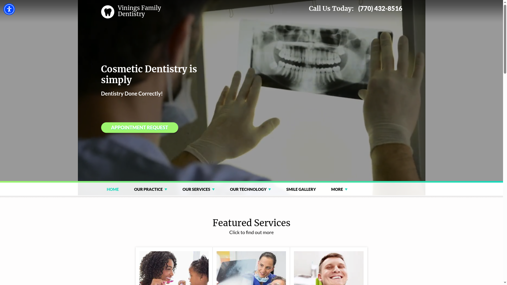
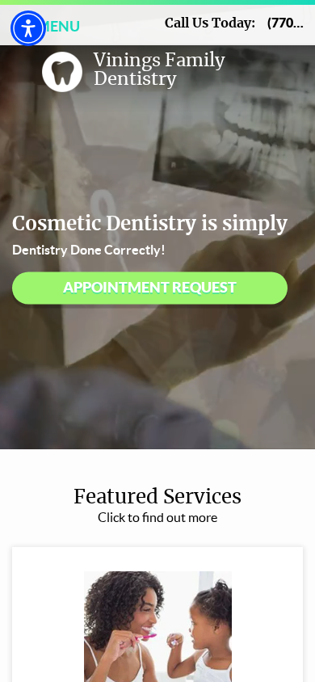
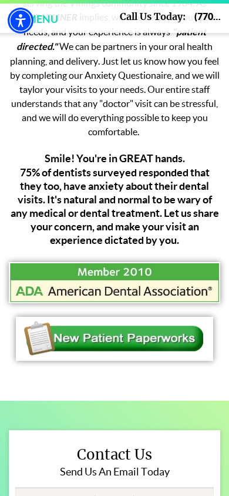
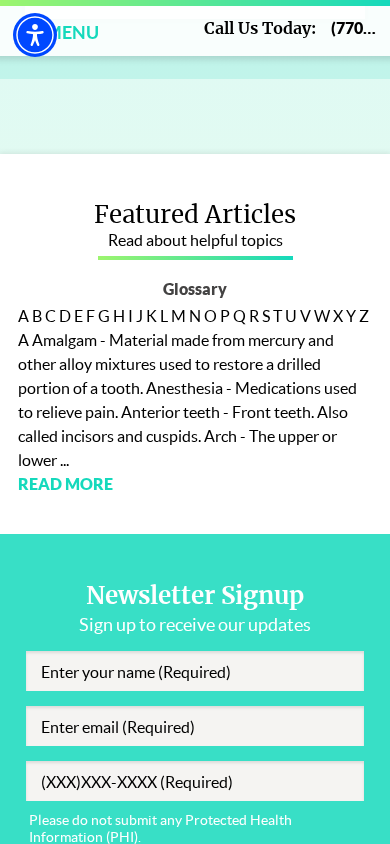

# Vinings Family Dentistry — Kestrel Lead Analysis

- **Business name:** Vinings Family Dentistry
- **Website:** <https://viningsfamilydentistry.com>
- **Captured/reviewed:** 2026-03-18
- **Status:** Pursue
- **Likely first offer:** Website Credibility Refresh

---

## 1. Prospect Snapshot

- **Business name:** Vinings Family Dentistry
- **Category / type:** Family / cosmetic dental practice
- **Apparent location:** Atlanta, Georgia
- **Short summary:** A dental practice serving the Atlanta/Vinings area, with general and cosmetic dentistry positioning, appointment-request flow, featured services, doctor profile, patient information resources, and article/newsletter content.

## 2. Analysis Mode / Confidence

- **Mode:** Primarily rendered browser analysis of the live site, supported by raw screenshot capture and public-page text extraction.
- **Tools used:** Playwright raw/live capture, OpenClaw browser inspection, web fetch.
- **Desktop review standard:** Representative desktop browser viewport at **1920x1080**.
- **Mobile review standard:** iPhone-class mobile viewport at roughly **390x844**.
- **Capture fidelity:** Raw/live capture with no style or layout overrides.
- **Capture path:** Desktop started headless but required a **headed fallback** because the site returned 403 to desktop headless automation; mobile succeeded in headless mode.
- **Confidence:** **Moderate**
- **Limits:**
  - The site was captured and reviewed from its rendered experience.
  - Desktop headless automation was blocked with 403, so desktop evidence was rerun successfully in headed mode.
  - `web_search` is still not properly configured in this environment, so I could not enrich with Maps/review/LinkedIn context.
  - Business-quality judgment is therefore based mostly on onsite signals.

## 3. First Impression

### What feels strong

- The practice appears real, established, and operational rather than speculative or flimsy.
- There is a visible attempt at patient reassurance, especially around anxiety and comfort.
- Appointment intent is clear early in the experience.
- ADA / association-style trust cues and doctor/profile content help support legitimacy.

### What feels weak

- The site feels **dated and template-driven**.
- The hero/message stack feels older-web rather than calm, premium, and current.
- Text presentation and hierarchy are uneven, especially on mobile.
- Some modules feel like they exist because the template supports them, not because they meaningfully improve conversion.

### Does the business seem more credible than the website suggests?

- **Yes.**
- The business likely feels more trustworthy and current in real life than the website communicates.

## 4. Evidence Gallery

### Full-page desktop view
- Evidence file: `evidence/00-fullpage-desktop-homepage.png`
- View source image: [00-fullpage-desktop-homepage.png](evidence/00-fullpage-desktop-homepage.png)
- Why it matters:
  - This gives the full desktop information architecture and shows how template sections stack into a fairly busy, older-feeling homepage.

### Full-page mobile view
- Evidence file: `evidence/00-fullpage-mobile-homepage.png`
- View source image: [00-fullpage-mobile-homepage.png](evidence/00-fullpage-mobile-homepage.png)
- Why it matters:
  - This shows the true mobile scroll length and makes the hierarchy/compression issues more obvious.

### First impression / hero
- Evidence file: `evidence/01-hero-first-impression.png`

- What it shows:
  - A large hero with background media/image treatment, broad cosmetic-dentistry messaging, and a prominent appointment-request CTA.
- Why it matters:
  - The site gets the primary action visible quickly, but the presentation feels dated and not especially premium for a trust-sensitive healthcare category.
- Suggested improvement:
  - Tighten the hero copy, modernize the visual treatment, improve text contrast/clarity, and make the first impression feel calmer and more current.

### Trust / credibility signal
- Evidence file: `evidence/02-trust-proof-section.png`

- What it shows:
  - Trust-oriented content around the practice, patient comfort, affiliations/badges, and doctor/practice-introduction material.
- Why it matters:
  - These are the right ingredients for trust, but they are presented in a way that feels heavier and less polished than it could.
- Suggested improvement:
  - Keep the trust material, but improve spacing, typography, and sequencing so credibility feels stronger without requiring so much reading.

### Weakness / UX issue #1
- Evidence file: `evidence/03-issue-homepage-rhythm.png`

- What it shows:
  - A homepage that shifts between services, welcome copy, badges, doctor profile, articles, and signup-style modules without especially clean narrative flow.
- Why it matters:
  - The site reads as an older practice template with many modules rather than a deliberately guided patient journey.
- Suggested improvement:
  - Simplify the homepage, reduce lower-value modules, and create a clearer sequence from reassurance → credibility → services → appointment.

### Weakness / UX issue #2
- Evidence file: `evidence/04-issue-cta-or-contact-friction.png`

- What it shows:
  - Contact/signup/engagement areas that feel more generic than intentional, with form or CTA treatment that may add friction rather than confidence.
- Why it matters:
  - For a dental practice site, the contact path should feel simple, immediate, and reassuring. Here it feels somewhat template-ish and less streamlined than ideal.
- Suggested improvement:
  - Make appointment/contact pathways clearer, reduce unnecessary fields or secondary asks, and strengthen click-to-call / appointment-request clarity.

### CTA / contact flow
- Evidence file: `evidence/05-cta-contact-section.png`

- What it shows:
  - A visible contact/appointment-oriented section deeper in the page.
- Why it matters:
  - The site does have conversion intent, but the user likely travels through too much dated or low-priority content before getting the cleanest trust + contact experience.
- Suggested improvement:
  - Surface the strongest appointment/contact path earlier and more consistently across the page.

### Mobile first impression
- Evidence file: `evidence/06-mobile-first-impression.png`

- What it shows:
  - The hero compresses quickly on mobile, with headline, CTA, top utility content, and accessibility controls competing for limited space.
- Why it matters:
  - Mobile visitors form an opinion quickly, and the first screen feels more cramped and less polished than it should.
- Suggested improvement:
  - Simplify the mobile hero, ensure cleaner spacing, and reduce overlap/competition between controls and content.

### Mobile issue / density
- Evidence file: `evidence/07-mobile-density-or-rhythm.png`

- What it shows:
  - Dense vertical stacking of welcome copy, trust signals, and auxiliary modules.
- Why it matters:
  - Mobile makes the older template structure feel heavier, increasing cognitive load for a user who probably just wants confidence and a straightforward next step.
- Suggested improvement:
  - Shorten the mobile homepage, compress long copy, and prioritize the most persuasive proof/CTA blocks.

### Mobile CTA / contact flow
- Evidence file: `evidence/08-mobile-cta-and-contact-flow.png`

- What it shows:
  - Mobile contact/signup/engagement modules lower in the page, where friction and extra input burden become more noticeable.
- Why it matters:
  - The mobile conversion path should feel lighter and more obvious than this.
- Suggested improvement:
  - Favor a smaller, clearer appointment/contact flow with explicit tap-to-call and low-friction request options.

## 5. Required Experience Dimensions

### Visual composure
- The site does not feel chaotic, but it does feel **old, busy, and somewhat templated**.
- It lacks the controlled calm that a strong contemporary healthcare site should project.
- Evidence:
  - `evidence/01-hero-first-impression.png`
  - `evidence/03-issue-homepage-rhythm.png`
  - `evidence/06-mobile-first-impression.png`

### Readability / contrast
- Readability is mixed.
- There is a lot of copy, and some sections feel dense rather than easy to scan.
- On mobile, hierarchy compression makes readability issues more noticeable.
- Evidence:
  - `evidence/02-trust-proof-section.png`
  - `evidence/07-mobile-density-or-rhythm.png`

### Motion quality
- The hero/media treatment suggests motion or richer visual behavior, but it does not come across as especially polished.
- Nothing appears dramatically broken from the rendered pass, but the top-of-page presentation feels more dated than premium.
- Evidence:
  - `evidence/01-hero-first-impression.png`

### Section rhythm / narrative flow
- This is one of the clearer weaknesses.
- The homepage moves through many modules without a particularly strong narrative arc.
- It feels more like a stocked practice-site template than a carefully designed patient journey.
- Evidence:
  - `evidence/03-issue-homepage-rhythm.png`
  - `evidence/07-mobile-density-or-rhythm.png`

### Premium / trust feel
- The site does have trust ingredients.
- But the execution makes the practice feel less current and less premium than it probably is.
- The website likely undersells the professionalism of the actual practice.
- Evidence:
  - `evidence/02-trust-proof-section.png`
  - `evidence/01-hero-first-impression.png`

### Calm vs. chaos
- This is not a chaotic site in the dramatic sense.
- But it does add more visual and informational noise than necessary.
- For a healthcare category where reassurance matters, it should feel simpler and steadier.
- Evidence:
  - `evidence/03-issue-homepage-rhythm.png`
  - `evidence/08-mobile-cta-and-contact-flow.png`

## 6. Website / Digital Findings

- The site appears to use an older dental-practice website framework/template, likely Officite-based.
- The homepage feels dated and somewhat overpopulated with modules.
- Messaging is understandable, but hierarchy and presentation are not especially sharp.
- There is visible appointment intent, but the overall site experience does not feel especially modern or premium.
- Trust material exists, but it could be sequenced and styled much better.
- Some article/newsletter/patient-resource content may help SEO, but on the homepage it can dilute the main patient journey.
- Mobile reveals more compression, density, and friction than desktop.
- The site likely undersells the practice’s actual quality.

## 7. Business Quality Signals

### Positive signals

- Real local practice positioning
- Dedicated appointment-request path
- Doctor/practice introduction present
- Patient-comfort messaging and trust cues
- Educational content and patient resources

### What that suggests

- This appears to be a legitimate, established local healthcare business.
- It likely has enough operational maturity to support a credible web refresh engagement.
- They probably care about patient trust and conversion, even if the current site is not expressing that especially well.

### Caution

- Without Maps/review enrichment, I’d avoid making strong claims about reputation or patient sentiment.
- The site feels lower-mid-market in web execution, so budget fit is plausible but probably not huge.

## 8. Kestrel Fit Assessment

**Decision:** Pursue

### Why
- The site visibly undersells the likely quality of the practice.
- Healthcare/dental is a category where calm trust and conversion clarity matter a lot.
- There is a realistic, specific wedge: improve credibility, reduce template feel, and streamline contact/appointment flow.
- This looks like the kind of business that could say yes to a focused refresh if the pitch is concrete and restrained.
- The gap is legible without needing to oversell the diagnosis.

## 9. Best First Offer

**Best first engagement:** Website Credibility Refresh

### Why this is the best wedge
- The biggest issue is not missing functionality so much as **dated trust presentation**.
- The practice already has the right ingredients: services, doctor identity, appointment flow, educational material.
- What’s missing is a more current, composed, and mobile-aware front door.
- A focused credibility refresh is easier to justify than a giant rebuild pitch.

## 10. Suggested Path Forward

- **Outreach now**
- Lead with a narrow, visual-trust angle rather than generic marketing promises.
- Focus on how the site likely makes the practice feel more dated than it is.
- Mention that the homepage could be simplified and made more reassuring on mobile without reinventing everything.

## 11. Ballpark Budget Range

- **Range:** **$6k–$15k**
- **Reason:**
  - This feels like a local practice with a real website need and plausible budget for a focused refresh.
  - The most credible first project is likely a homepage / key-page credibility refresh plus contact/appointment cleanup, not a large custom platform build.

## 12. Outreach Tailoring

### Possible subject lines
- **A quick observation about Vinings Family Dentistry’s website**
- **Your practice feels more current than the website does**

### Outreach angle summary
- Vinings Family Dentistry looks like a real, credible local practice, but the site feels older and more template-driven than the business likely is. A restrained refresh could make it feel more current, trustworthy, and easier to act on—especially on mobile.

### Personalized outreach email draft

Hi — I spent a little time looking through Vinings Family Dentistry’s website.

My impression was that the practice itself likely feels more current and reassuring than the website does right now. The site has the right ingredients — appointment flow, doctor/practice introduction, patient-comfort messaging, educational content — but the overall presentation feels older and more template-driven than it needs to.

That kind of gap is often fixable without rebuilding everything. Sometimes the biggest win is simply making the homepage feel calmer, more current, and easier to act on, especially for mobile visitors who are just trying to decide whether they trust the practice enough to take the next step.

I run Kestrel Labs, and this is the kind of credibility/clarity work I help with on a selective basis. If useful, I’d be happy to send over a few concrete observations on what I’d simplify first.

Best,  
Daymian  
Kestrel Labs

## 13. Internal Summary for CRM

- **One-line summary:** Legit local dental practice with a dated, template-driven site that likely undersells the real quality of the business.
- **Likely offer:** Website Credibility Refresh
- **Disposition:** Pursue
- **Next step:** Send outreach focused on modernizing trust presentation, reducing template feel, and improving mobile appointment/contact clarity.
