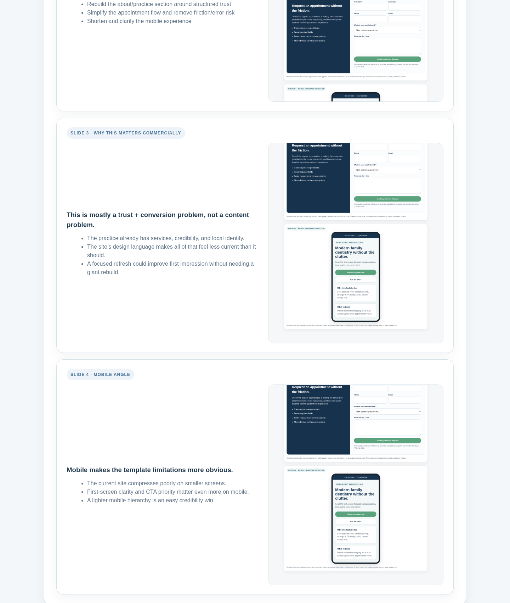
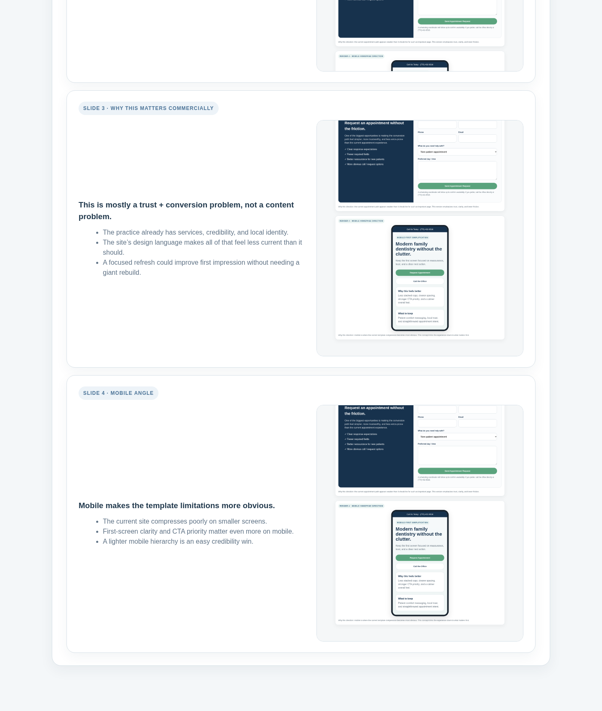

# Vinings Family Dentistry — Mini Deck

A short, client-facing summary of the suggested update direction.

## Slide 1 — Core diagnosis

## Slide 2 — What to update first

## Slide 3 — Why this matters commercially

## Slide 4 — Mobile angle

## Related files
- Concept board: `recommendations-and-renders.html`
- Recommendation brief: `suggested-updates.md`
- Render images: `renders/`
