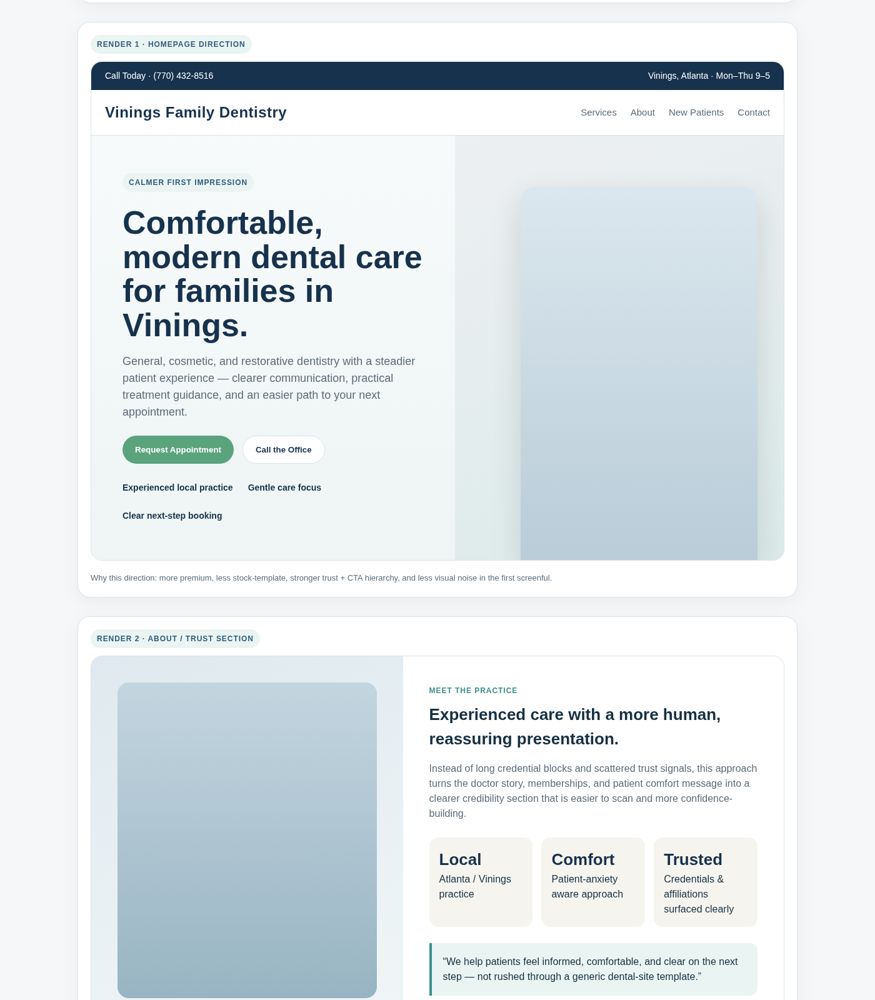
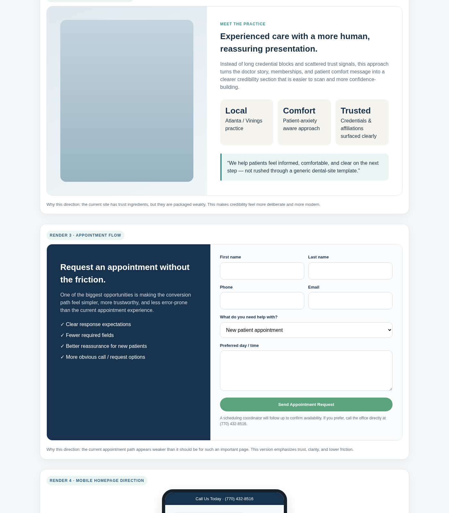
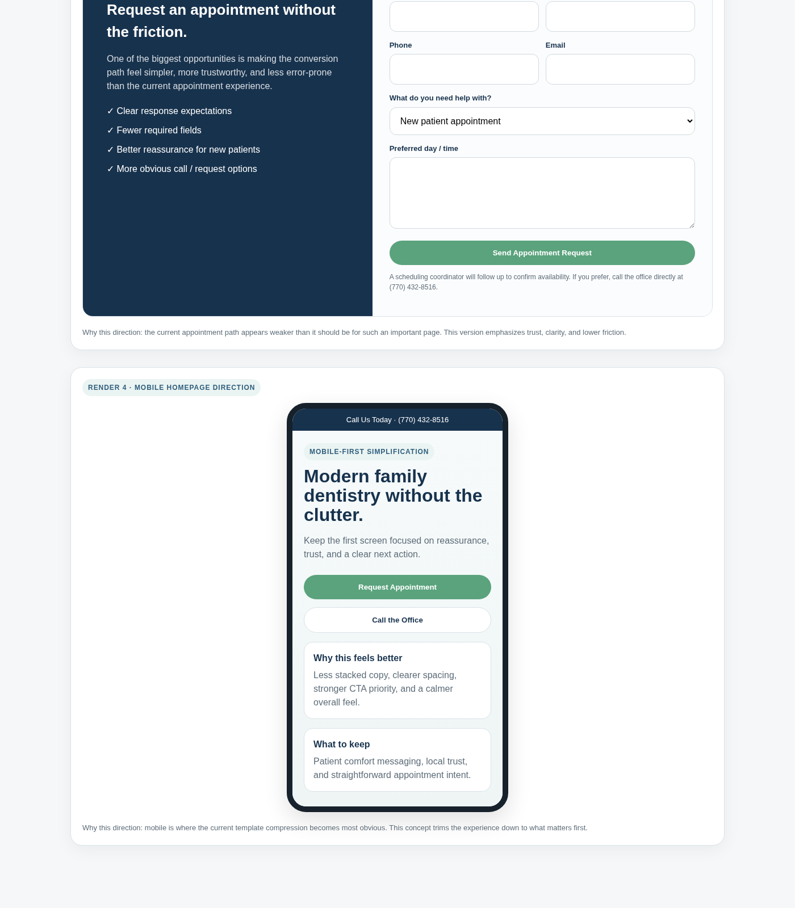
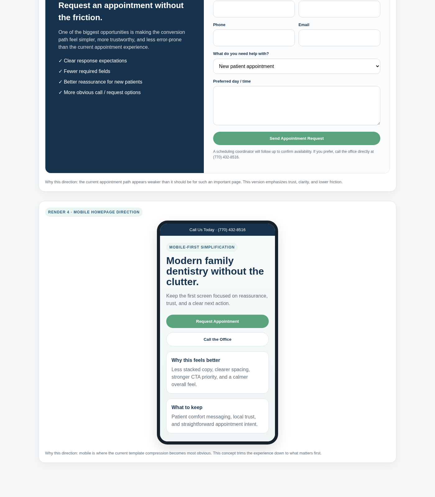

# Vinings Family Dentistry — Suggested Updates

This is a follow-on recommendation brief based on the sitemap-driven lead analysis.

## Priority recommendations

### 1. Rebuild the first impression around calm trust
The current homepage hero makes the practice feel older and more template-driven than it likely is.

Suggested changes:
- simplify the hero copy
- reduce visual clutter in the first screenful
- emphasize local trust, patient comfort, and a clear next step
- replace broad generic cosmetic-dentistry phrasing with more grounded, patient-centered language
- make call + appointment actions equally clear

### 2. Repackage the doctor / practice credibility story
The trust ingredients are present, but they are scattered and text-heavy.

Suggested changes:
- turn the doctor story into a stronger trust section
- surface affiliations/credentials more clearly
- tighten the copy so it reads faster
- include more visual structure around practice values, patient comfort, and local credibility

### 3. Simplify the appointment path
The appointment flow is one of the most commercially important paths on the site and currently feels weaker than it should.

Suggested changes:
- reduce friction in the appointment form
- clarify what happens after a request is submitted
- make click-to-call more prominent
- ensure the form/error state is working cleanly
- make the appointment page feel more trustworthy and intentional

### 4. Improve the mobile experience
The current template compression becomes especially obvious on mobile.

Suggested changes:
- shorten the homepage
- simplify the top mobile hierarchy
- reduce stacked text blocks
- prioritize trust + CTA sooner
- make buttons and spacing feel more deliberate

### 5. Make interior pages feel less generic
The service and about pages work, but they feel like stock platform pages instead of pages that strengthen the practice brand.

Suggested changes:
- add stronger service-page framing around patient outcomes and next steps
- make about/practice pages feel more personal and less directory-like
- use more deliberate section rhythm across key pages

## Visual concept renders

### Render 1 — Homepage direction

### Render 2 — About / trust direction

### Render 3 — Appointment flow direction

### Render 4 — Mobile homepage direction

## Source files
- HTML concept board: `recommendations-and-renders.html`
- Render images: `renders/`
